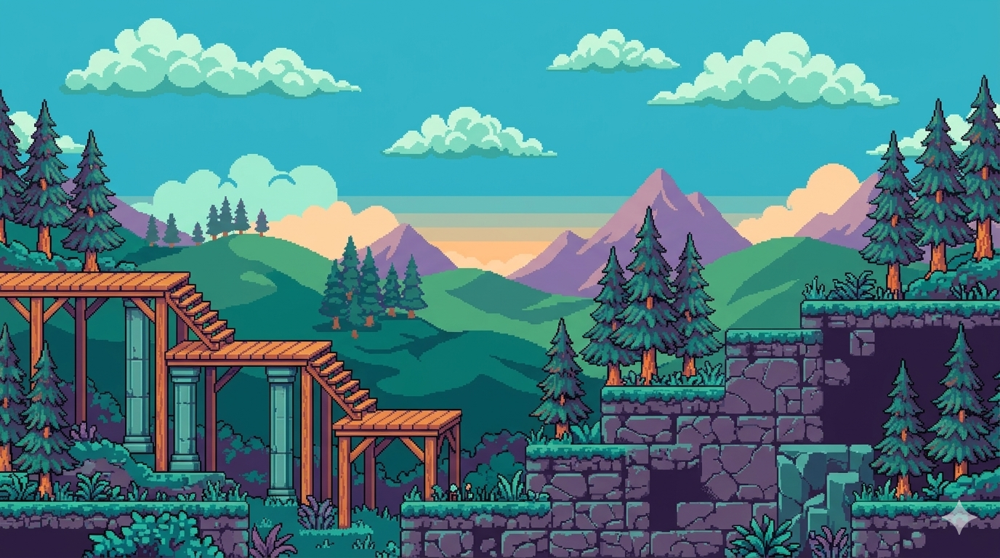

# 2D Game Engine

A 2D game engine built from scratch in Java using LWJGL and OpenGL, structured around a Super Mario clone. This is a learning project following the GamesWithGabe course on freeCodeCamp.

## What it does

- Creates an OpenGL window via GLFW
- Runs a render loop with v-sync
- Built to expand into a full game engine with scenes, shaders, physics, and a level editor

## Tech stack

- Java 17+
- LWJGL 3.4.1 (OpenGL, GLFW, OpenAL, STB, Assimp, NFD)
- JOML 1.10.8 (math)
- Gradle (Kotlin DSL)

## Prerequisites

- JDK 17 or later
- Gradle 8+
- Linux (natives are currently set to `natives-linux` in `build.gradle.kts`)

## Run it

```bash
git clone <repo-url>
cd <project-folder>
./gradlew run
```

## Credit

Based on the course: [Code a 2D Game Engine using Java - Full Course for Beginners](https://www.youtube.com/watch?v=025QFeZfeyM) by GamesWithGabe, published on freeCodeCamp.